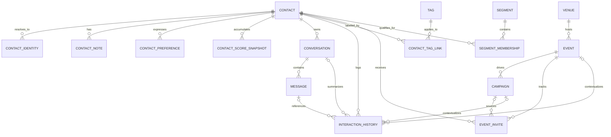

# Promoter CRM ERD

This extension is not a port of `promoter-assistant`'s Airtable-style schema.
It is an OpenClaw-native CRM foundation shaped around Chen-style ERD
principles:

- model core business nouns as first-class entities
- model many-to-many relationships explicitly
- separate identity resolution from the canonical contact record
- keep activity history append-only where possible
- let AI read from normalized facts instead of denormalized blobs

Diagram assets:

- source: `ERD.mmd`
- rendered image: `ERD.svg`

## Conceptual model

The CRM centers on `Contact`, because promoters reason about people first and
channels second. Around that core, the design splits into four clusters:

- identity: who this person is across platforms
- relationship memory: tags, notes, preferences, score history
- event operations: venues, events, campaigns, invites, attendance outcomes
- communication history: conversations, messages, and higher-level interaction
  summaries

Mermaid uses crow's-foot notation, but the decomposition below follows Chen's
approach of separating entities from relationship entities.

## Entity definitions

### Core identity entities

| Entity            | Purpose                                                    | Current table        |
| ----------------- | ---------------------------------------------------------- | -------------------- |
| `Contact`         | Canonical promoter-facing person record                    | `contacts`           |
| `ContactIdentity` | Channel/source-specific identity used for merge and dedupe | `contact_identities` |

`Contact` stays intentionally channel-agnostic. Phone numbers, emails,
Instagram handles, ManyChat IDs, and future iMessage/WhatsApp keys belong in
`ContactIdentity`, not on the canonical record.

This is the main Chen-inspired optimization in the design: identity resolution
is its own entity set, instead of being flattened onto the person row.

### Relationship memory entities

| Entity                 | Purpose                                                 | Current table             |
| ---------------------- | ------------------------------------------------------- | ------------------------- |
| `Tag`                  | Reusable labels for segmentation and workflow filters   | `tags`                    |
| `ContactTagLink`       | Associative entity between contacts and tags            | `contact_tag_links`       |
| `ContactNote`          | Promoter-authored notes and qualitative memory          | `contact_notes`           |
| `ContactPreference`    | Structured likes/avoids for venue, music, borough, vibe | `contact_preferences`     |
| `ContactScoreSnapshot` | Historical scoring facts, not just latest score         | `contact_score_snapshots` |
| `Segment`              | Saved audience definition                               | `segments`                |
| `SegmentMembership`    | Materialized segment result for a contact               | `segment_memberships`     |

`ContactTagLink` and `SegmentMembership` are explicit relationship entities, not
hidden arrays. That keeps segmentation explainable and queryable.

### Event operations entities

| Entity        | Purpose                                                     | Current table   |
| ------------- | ----------------------------------------------------------- | --------------- |
| `Venue`       | Place profile and audience context                          | `venues`        |
| `Event`       | Night-specific operating unit                               | `events`        |
| `Campaign`    | Outreach plan tied to an event or objective                 | `campaigns`     |
| `EventInvite` | Associative entity between contact and event, with outcomes | `event_invites` |

`EventInvite` is the operational heart of promoter workflow. Instead of treating
RSVP and attendance as loose fields on contacts, this model stores the
relationship between one person and one event as its own fact record.

That gives us clean support for:

- invite status
- RSVP status
- attendance result
- spend and table outcome
- guest contribution notes
- campaign attribution

### Communication entities

| Entity               | Purpose                                                   | Current table         |
| -------------------- | --------------------------------------------------------- | --------------------- |
| `Conversation`       | Contact-level thread per channel/thread identity          | `conversations`       |
| `Message`            | Individual inbound/outbound message facts                 | `messages`            |
| `InteractionHistory` | Higher-level timeline events, summaries, and next actions | `interaction_history` |

`Message` stores raw communication facts. `InteractionHistory` stores interpreted
or workflow-level facts, such as:

- outreach attempt
- reply received
- attendance logged
- follow-up recommendation
- summary generated
- campaign touch recorded

This split prevents AI-generated summaries from polluting the raw message log
while still keeping them queryable.

## Cardinality decisions

These are the key business rules currently encoded in the schema:

- one `Contact` can have many `ContactIdentity` rows
- one normalized identity value is unique within a channel
- one `Contact` can belong to many `Tag`s through `ContactTagLink`
- one `Venue` can host many `Event`s
- one `Event` can have many `Campaign`s
- one `Contact` can have at most one `EventInvite` per `Event`
- one `Contact` can have many `Conversation`s, usually one per channel thread
- one `Conversation` can have many `Message`s
- one `Segment` can contain many `Contact`s through `SegmentMembership`
- one `Contact` can accumulate many `ContactScoreSnapshot`s over time

## Why this is more optimized than the source app schema

Compared with an Airtable-shaped design, this structure is more stable for
OpenClaw because it:

- avoids repeated contact fields across invites, events, and messages
- preserves history instead of overwriting "latest" values
- makes dedupe and merge logic a first-class concern
- supports relational queries for agent tools without JSON-heavy scans
- cleanly separates raw channel data from AI-generated interpretations

In Chen terms, we are minimizing attribute leakage across entity types and
promoting important relationships into their own entities when they carry
business meaning.

## Mapping to the CRM product spec

| CRM concept                    | OpenClaw entity path                                                  |
| ------------------------------ | --------------------------------------------------------------------- |
| contact profile                | `contacts` + `contact_identities` + `contact_preferences`             |
| dedupe / identity merge        | `contact_identities` uniqueness plus merge logic in the store         |
| tags and notes                 | `tags`, `contact_tag_links`, `contact_notes`                          |
| unified inbox                  | `conversations` + `messages`                                          |
| event invite workflow          | `events` + `campaigns` + `event_invites`                              |
| attendance and promoter memory | `event_invites` + `interaction_history`                               |
| guest scoring                  | `contact_score_snapshots` and `contacts.manual_score_override`        |
| saved audiences                | `segments` + `segment_memberships`                                    |
| best next action and summaries | `interaction_history.best_next_action`, `interaction_history.summary` |

## Extension points for the next setup phases

This ERD gives us clean places to attach the remaining OpenClaw work:

1. Source ingestion
   - Google Contacts, ManyChat, CSV, and later Instagram/iMessage/WhatsApp
     should write into `Contact` plus `ContactIdentity`
   - source-specific metadata should stay in identity or import metadata, not
     on `Contact`

2. Messaging integration
   - channel adapters should map threads to `Conversation`
   - inbound/outbound payloads should map to `Message`
   - agent summaries and next-step recommendations should map to
     `InteractionHistory`

3. AI workflows
   - invite ranking reads `Contact`, latest `ContactScoreSnapshot`,
     `EventInvite`, and `InteractionHistory`
   - drafting reads `ContactPreference`, tags, notes, and recent messages
   - follow-up prioritization reads stale conversations, recent outcomes, and
     score history

4. Reporting
   - venue performance rolls up from `Event` and `EventInvite`
   - promoter pipeline dashboards read from events, invites, scores,
     conversations, and interaction history without reshaping the schema

## Current implementation note

The current schema in `src/schema.ts` already implements this ERD at the
storage layer. The next steps are adapter work and agent workflow wiring, not a
database redesign.
